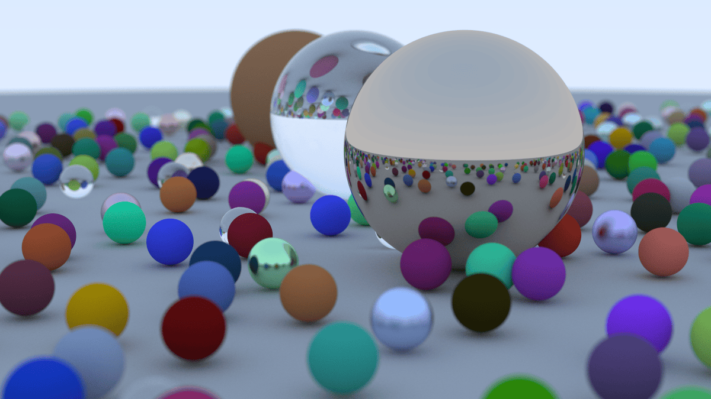

### Overview
This repository contains my implementation of a software raytracer in C++ after reading the book "Ray Tracing in One Weekend"

PNG converted output of the program with a 500 sample per pixel render


### Building and running
The project is a very simple flat structure of multiple header files and a single .cc file.
Building is handled by cmake:
```
git clone https://github.com/mmorgan00/software_raytracer.git
cd software_raytracer
cmake -S . -B ./build
cd build
cmake --build .
```
The program is structured such that a output redirection into a .ppm file is required. 
At some point I may revisit and support other image formats, a default output, or a basic gui of some kind
For now:
```
$ software_raytracer/build
./raytracing > filename.ppm
```
The program will then begin rendering. Depending on your CPU specs this might take a while.
There is no opitimization done beyond what the compiler will do, each pixel is renderer sequentially in scanline order

